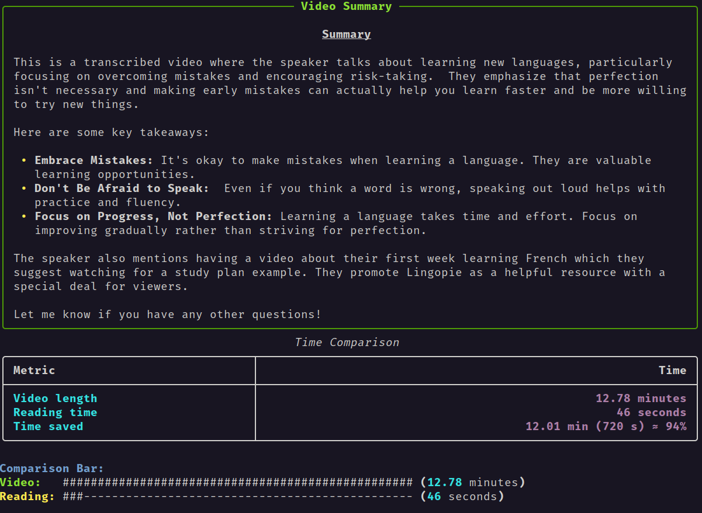

# yt-tldr

Life is too short to be wasted on long videos.

Let's just use an AI to summarize them for us.

You know the drill:

1. `pip install -r requirements.txt` (please use a virtual environment)
2. `python main.py` (or `python main.py <url>`)
3. Profit!

This project is a work in progress and not to be intended as an official release.

I just needed a quick and free solution for the night, might update it in the future.

Be safe and have fun :)
