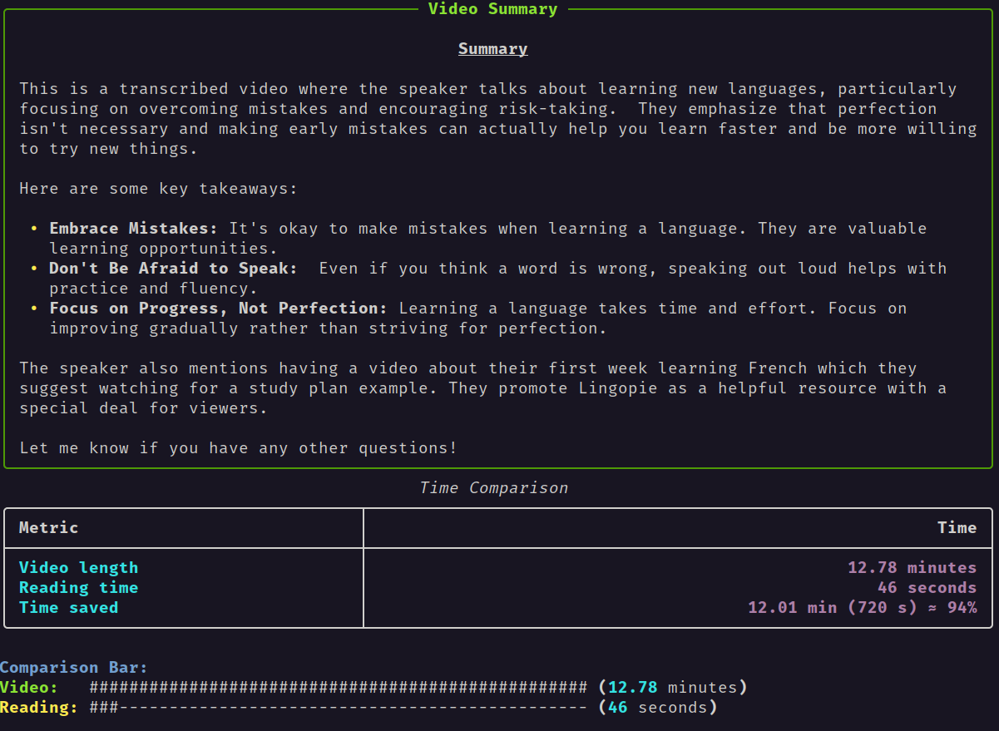

# yt-tldr

Summarize any YouTube video with AI. Paste a URL, pick a model, get a concise summary and time-saved stats — via a web dashboard, terminal CLI, or raw API.



---

## How it works

```
YouTube URL
    │
    ├─ Fetch video info (yt-dlp)
    ├─ Check for subtitles → extract text
    │   └─ No subtitles → download audio → transcribe (Whisper)
    ├─ Summarize transcript (OpenAI / Anthropic / Gemini / Ollama)
    └─ Return summary + time stats
```

---

## Project structure

```
yt-tldr/
├── backend/          # FastAPI REST API
├── cli/              # Python terminal client (Rich UI)
├── frontend/         # React + Vite web dashboard
└── docker-compose.yml
```

---

## Supported LLMs

| Model                         | Needs API key                    |
| ----------------------------- | -------------------------------- |
| OpenAI (gpt-4o-mini)          | Yes — `OPENAI_API_KEY`           |
| Anthropic (claude-3-5-sonnet) | Yes — `ANTHROPIC_API_KEY`        |
| Gemini (gemini-1.5-flash)     | Yes — `GEMINI_API_KEY`           |
| Ollama (local)                | No — just Ollama running locally |

---

## Quickstart

### 1. Backend

```bash
cd backend
pip install -r requirements.txt
python server.py
# → http://localhost:8000
```

Or with Docker (recommended):

```bash
docker compose up --build
```

The Docker setup mounts `./backend` as a volume so code changes are picked up automatically without a rebuild.

### 2. Frontend

```bash
cd frontend
cp .env.example .env   # set VITE_API_URL if backend is not on localhost:8000
npm install
npm run dev
# → http://localhost:5173
```

### 3. CLI

```bash
cd cli
cp .env.example .env   # set API_BASE_URL if needed
pip install -r requirements.txt

python main.py                                           # interactive prompts
python main.py "https://www.youtube.com/watch?v=..."    # pass URL directly
```

---

## API

### `GET /health`

```json
{ "status": "ok" }
```

### `GET /llms`

```json
{
  "llms": [
    { "name": "OpenAI", "value": "OPENAI" },
    { "name": "Anthropic", "value": "ANTHROPIC" },
    { "name": "Gemini", "value": "GEMINI" },
    { "name": "Ollama", "value": "OLLAMA" }
  ]
}
```

### `POST /summarize`

**Request**

```json
{
  "url": "https://www.youtube.com/watch?v=kpTxAIPcEAY",
  "llm": "OLLAMA",
  "language": "english"
}
```

**Response**

```json
{
  "video_title": "Some Video Title",
  "video_url": "https://www.youtube.com/watch?v=kpTxAIPcEAY",
  "llm_used": "Ollama",
  "language": "english",
  "transcript": "Full transcript text...",
  "summary": "AI-generated summary...",
  "time_stats": {
    "video_length_seconds": 1845,
    "video_length_minutes": 30.75,
    "word_count": 312,
    "reading_time_seconds": 93.6,
    "reading_time_minutes": 1.56,
    "time_saved_seconds": 1751.4,
    "time_saved_minutes": 29.19,
    "percentage_saved": 94.9
  }
}
```

Errors return standard HTTP status codes: `422` for invalid input, `500` for processing failures.

---

## Environment variables

### `backend/.env`

| Variable            | Required           | Default                  | Description           |
| ------------------- | ------------------ | ------------------------ | --------------------- |
| `OPENAI_API_KEY`    | Only for OpenAI    | —                        | OpenAI API key        |
| `ANTHROPIC_API_KEY` | Only for Anthropic | —                        | Anthropic API key     |
| `GEMINI_API_KEY`    | Only for Gemini    | —                        | Google Gemini API key |
| `OLLAMA_HOST`       | No                 | `http://localhost:11434` | Ollama server URL     |
| `OLLAMA_MODEL`      | No                 | `gemma2:latest`          | Ollama model to use   |

### `frontend/.env`

| Variable       | Required | Default                 | Description          |
| -------------- | -------- | ----------------------- | -------------------- |
| `VITE_API_URL` | Yes      | `http://localhost:8000` | Backend API base URL |

### `cli/.env`

| Variable       | Required | Default                 | Description          |
| -------------- | -------- | ----------------------- | -------------------- |
| `API_BASE_URL` | No       | `http://localhost:8000` | Backend API base URL |

---

## Docker notes

- Base image: `python:3.10-slim`
- System packages: `ffmpeg` (audio processing), `nodejs` (yt-dlp JS runtime)
- The `whisper_cache` named volume persists the Whisper model across container restarts
- `network_mode: host` lets the container reach a locally running Ollama instance without extra configuration
- `./backend` is bind-mounted into `/app` — edit Python files and uvicorn reloads automatically
